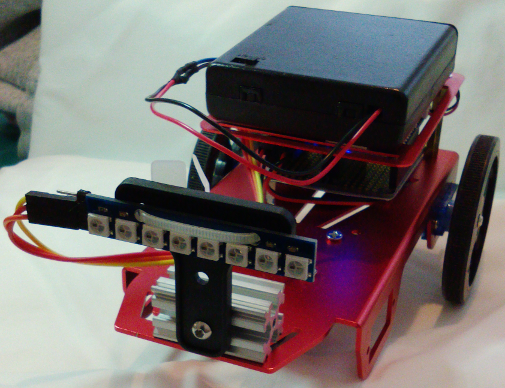
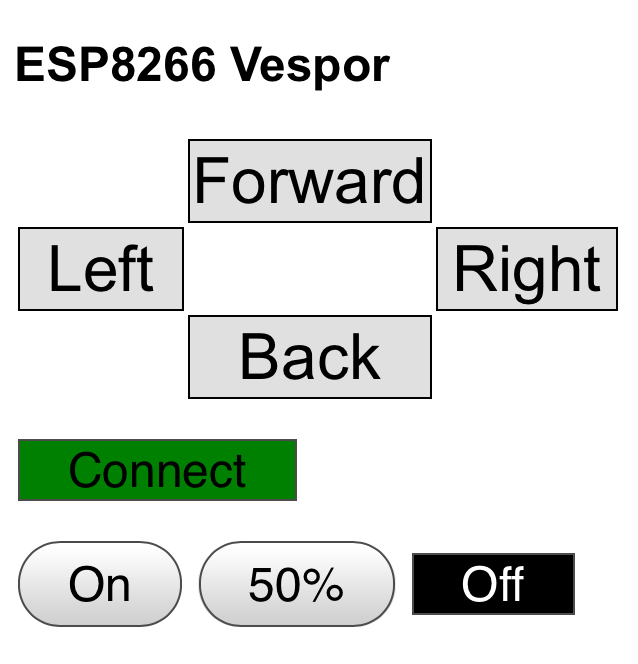

# Vespor -- ESP8266 Remotely Operated Vehicle

Vespor is a WiFi miniature Remotely Operated Vehicle (ROV) with Web control
application. Any device with a modern web browser can control Vespor. For
example, Chrome, Firefox, and Safari browsers on IOS, Android, Win, Mac, and
Linux can control Vespor. There is no application to install because the
control application consists of HTML, CSS, and Javascript which are sent
from the rover web server.

Vespor hardware is based on the Adafruit Mini Rover kit with Feather Huzzah
ESP8266 and FeatherWing Motor boards.

## Features ##

* Control Vespor using IOS, Android, Win, Mac, Linux, or anything with an HMTL5
  browser such as Chrome, Firefox, and Safari. Instead of developing a native
  application for every OS, the Vespor control application runs inside any
  modern web browser.

* Vespor is a WiFi Access Point so it can be easily found. Look for "Vespor
  ROV" in WiFi settings. The WiFi password is "GoVespor".

* Vespor does not need access to the Internet so it can be used outside.

* The Vespor control WebUI consists of about 130 lines of HTML, CSS, and
  Javascript. Javascript and CSS libraries are not used to make it easier to
  see how things work with the HTML5 APIs. The Web User Interface (WebUI) is
  included in the Arduino sketch so it can be easily modified.

## Hardware Parts ##

* Adafruit Mini Rover Kit, Feather Huzzah ESP8266, FeatherWing Motor

See the Adafruit tutorial but replace the Feather BLE board with the Feather
Huzzah ESP8266.

The Adafruit tutorial "Overview" and "Wiring and Assembly" sections apply here.
Ignore the rest of the tutorial because the ESP8266 code is provided in this
repo.

https://learn.adafruit.com/bluefruit-feather-robot/

* Optional, NeoPixel stick

The stick is mounted on the front of rover as headlights. The UI has buttons to
turn the LEDs on and off.

VDC is connected to the lithium battery via the Feather BAT pin.
GND is connected to any GND pin.
DIN is connected to GPIO2.

## External Libraries ##

Install the following libraries using the Arduino IDE library manager.

* WebSockets library
* Adafruit Motor Shield library
* NeoPixelBus library

## Using Vespor ##

Open WiFi manager on your phone, tablet, or computer. Find the AP named "Vespor
AP". The WiFi password is "GoVespor". On IOS devices, you may have to turn Auto
Login off. On Android devices you may have to tell Android to use the AP even
thought it does not have access to the Internet.

If the OS opens a login or sign in screen try to exit without dropping the
connection the AP. Open a browser window then connect to any such as URL
go.com.  Vespor ignores the URL and presents the rover control UI.

The Connect button should be green. If it is red, the connection to the rover
is not working. Press the button to reconnect. If it stays red, check the
connection to the rover AP.

The Forward, Back, Left, and Right buttons control the rover movement.

The On, 50%, and Off buttons control the optional LEDs.

